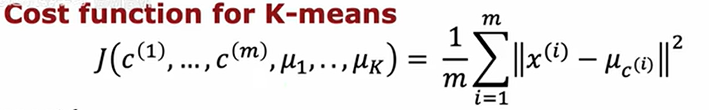
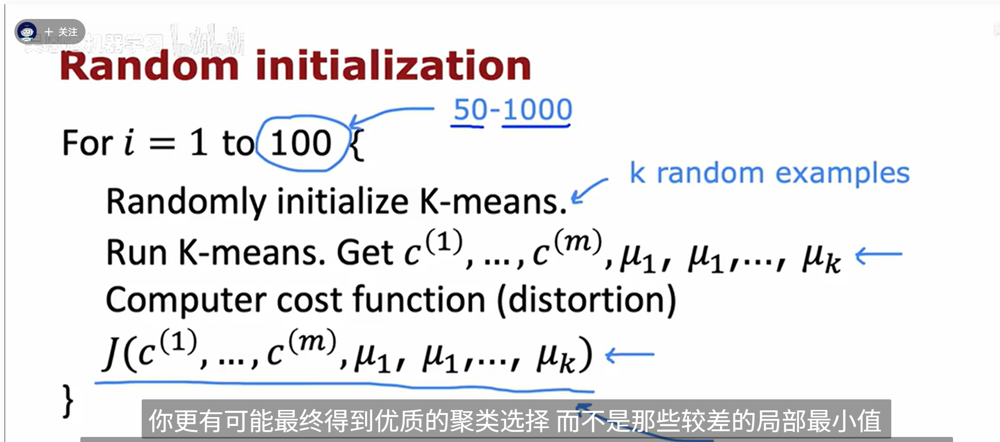
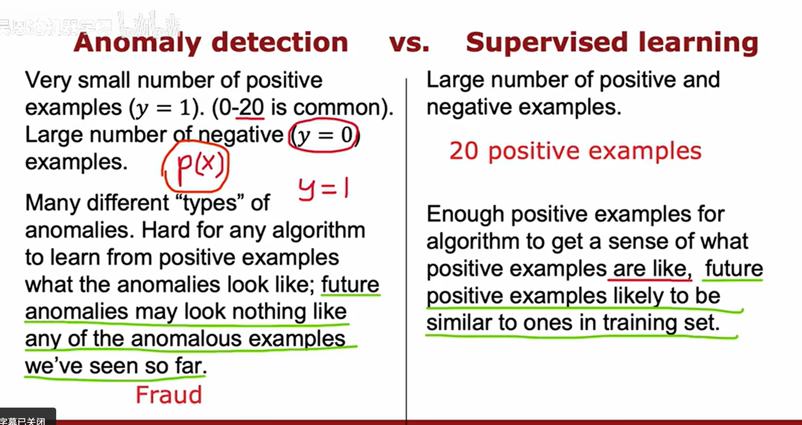

cross valid error > training error: variance problem
baseline to training error > then training to cv, then bias problem.

learning alg has high bias, then getting more training data would not help much, but if high variance, then might work (with small lambda regularization)

Get more training examples - fix high variance
try smaller sets of features - fix high variance
try additional features - fixes high bias
try adding polynomial features - fixes high bias
increase (fix high variance), decrease (fix high bias) lambda in regular.

bigger NN with good regular. is good!
large NN is low bias machine

Transfer learning: use parameters from previously trained model on something else, keep the initial params of first few layers
and eliminate the last layer and train on new data like that

precision = true positive / predicted positives
recall = true positive / actual positives

K means algorithm: (read about this)

assign points to cluster centroids (center of cluster of points)
recompute the centroids

Distortion function: cost function in k means alg

Second step is updating mu 1 to mu k while holding c1 to cm fixed.

How do you decide what value of k (num of clusters?)

- can choose values for how well it performs for a later purpose (classifying t-shirts, can use k = 5 maybe for 5 diff. size of t shirts)

Anomaly Detection

- create a model for x1 and x2 (which values have the highest or lowest probabilities)
- calculate p(x test) < epsilon, raise flag sayinga anomaly

Reinforcement Learning

markov decision process:

future depends on where you are now, not how you got here.

Discount factor

Q(s, a) for every state & action, gives us good way to compute optimal policy pi of s

Bellman Equation: best possible return from state
