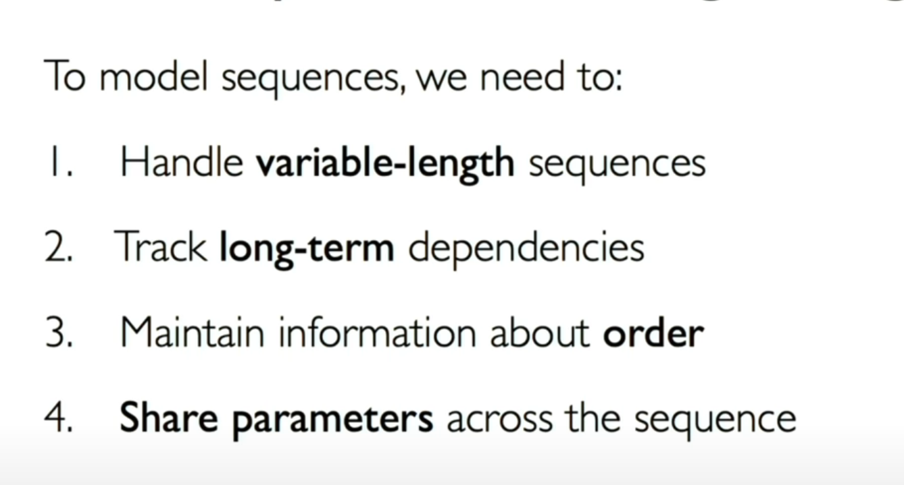

## nn.module

- forward function has to be implemented.

## nn.Linear

- intialized randomly using Kaiming initialization

## nn.utils.clip_grad_norm

- Computes the gradient norm: It calculates the Euclidean norm (magnitude) of the gradients of the model's parameters.
  Clips the gradient norm: If the computed gradient norm exceeds the specified max_norm (in this case, 1.0), it scales the gradients to have a norm equal to max_norm. This is done in-place, meaning that the original gradients are modified.

## Residual Connections

- add input to a layer to output of that layer.
- helps prevent vanishing gradients, helps stabilize training.
- In a typical transformer block, a residual connection is applied after the multi-head self-attention layer and after the feedforward network. This is often followed by layer normalization.

Analogy:

Imagine you’re writing an essay:

Without residual connections: Every time you revise a draft, you throw away the previous version and start from scratch. This makes progress slow, and you might lose important ideas.
With residual connections: Instead of starting from scratch, you keep your previous draft and make small edits. This allows you to gradually improve the essay while keeping the core content.
Residual connections work the same way:

Instead of completely replacing an input representation, they incrementally refine it.
This helps avoid catastrophic forgetting where earlier learned information is lost.

## Feed Forward Attention

- The feedforward block is an MLP applied individually to each token. It transforms embeddings, introduces non-linearity, and expands feature capacity beyond self-attention.

## Multiheaded Attention

- Projection layer: concatenated tensor doesn't have same embedding dimension. Linear layer compresses it down to match the embedding dimension.

- the projection layer is learnable (it's a linear layer), it actually learns a smart weighted combination of all the heads. It allows the model to "mix" and combine the information learned by the different attention heads.

- Responsible for cross head attention.

- Transformer models maintain consistent embedding dimension for all layers. Without the projection layer, this would be incompatible.

## KV Cache:

avoiding recomputation by using cached key and value matrices in transformer architectures

## Hyperparameter: choices about algorithm that you set rather then learn

## Quantization: representing values in fewer bits then FP32

    - 8 bit or 4 bit

example: (1000 _ 128) matrix which will contain 1000 _ 128 _ 4 bytes in FP32
INT8 requires 1 byte per value so result will be 1000 _ 128 bytes

Can be used to deploy large models on edge devices like it is in huggingface

## Dimensionality Reduction: reduces features / columns in key val matrices

example: (1000 _ 128) matrix downscaled to (1000 _ 32) will obviously save memory

Can be used in speech to text models to filter out redundant features in long sequences

## Sparse Representation: store sig figs in a matrix. Zero out or remove useless values

    - Top K Sparsity: Retain only the top-k largest values in each row of the key or value matrix.
    - Threshold Sparsity: Zero out values below a certain threshold.

example: [0.01, 0.50, 0.03, 0.70, 0.02]

Top K with K = 2: [0, 0.50, 0, 0.70, 0]
Threshold Sparsity = 0.05: [0, 0.50, 0, 0.70, 0]

Sparse representations are useful in recommender systems and memory-intensive applications like GPT models where storing and processing every value can be prohibitive.

## Memory Mapping / Chunking: Instead of storing the entire KV cache in memory, chunk the data into smaller parts and load only the required chunks during computation.

example: (10000, 64), divide into 10 chunks of 1000 and store only one chunk in memory at one time, reduce peak memory usage

Streaming models where inputs are processed incrementally, such as in real-time transcription or language translation.

# Mixture of Experts

### Experts: sub-networks (could be 100s of them)

### Gating network: determines which experts to activate for a given input. It outputs a probability distribution over the experts, often selecting the top-k highest probabilities.

- can be deterministic or probabilistic
- Ensuring all experts are used equitably, preventing overloading of certain experts while others remain underutilized.
- Efficiently implementing sparse activation to avoid computation for unselected experts.

example: 10 experts and gating network that activates 2 experts per input. Input x predicts which 2 experts are most relevant for x.

Only these 2 experts process x and their outputs are combined

### Sparsity in MoE

- Efficiency: Activating only a few experts reduces the number of parameters and operations involved in each forward pass

- Also very scalable. Can add more experts without increasing cost.

### Specialization of Experts

- Each expert in an MoE can specialize in processing a specific type of input. During training, different experts are encouraged to focus on different regions of the input space. Allows processing of heterogenous data.

- In an MoE with 10 experts, if the gating network consistently activates only 2 experts for all inputs, the remaining 8 experts are effectively unused. A load balancing term in the loss function penalizes this behavior, encouraging the gating network to distribute activations more evenly.

## Regularization improves model generalization by preventing overfitting

### Adding constraints to model complexity

### Encouraging the model to focus on the most relevant patterns in the data.

L2 Regularization:

It penalizes large weights by adding the sum of the squared values of the weights to the loss function. The regularization term encourages the model to keep weights smaller, effectively reducing the model's complexity.

## Dropout: a fraction of neurons in a layer is randomly "dropped" (set to zero) during each training iteration. This prevents the network from becoming overly reliant on specific neurons, encouraging more robust feature representations.

## Early Stopping: halts training once the model's performance on a validation set stops improving, preventing overfitting and saving computational resources.

## Data Augmentation: generates additional training samples by applying transformations to the existing data. This increases the dataset's diversity and reduces overfitting.

## Weight Sharing: reuses the same set of weights across multiple parts of the model, reducing the number of parameters and improving generalization.

- Reduces the model's size and computational complexity.

## Recurrent Neural networks

- cell state = f(input, old state)

Parameter intialization: initialize biases to 0, helps prevent weights from shrinking to zero.

## Long Short Term Memory

- maintain a cell state
- use gates to control flow of information

Limitations:

- encoding sequences limited by memory usage (leading to lost information)
- slow, no parallelization.

## Attention

- Compare query to all keys. How similar is it?
- Attention Score: compute pairwise similarity between query and key

Encode position information
extract key, query, value for search
compute attention weighting
extract features with high attention

## Convolutional Neural networks

- hierarchy of features

Low level features
Mid level features
High level features

# Reinforcement Learning

Q function: takes in state and action, returns expected reward at some time in future
policy function: infer the best action to take at a state

Only using reward:

- unfairness: improvement may not be rewarded properly
- instability: constantly chasing higher reward may lead to inconsistent results, or large reward fluctuations

Value function:

- like a score line. (predicted score line). This has to be constantly readjusted as progress is made. Acts as a baseline.

Big question: how much do you outperform that baseline?

Subtracting score line reduces variance in training, giving higher gradient signals to actions doing well.

Giving too much reward might lead to extreme exploration, which causes reward volatility.

## PPO (proximal policy optimization)

- clip mechanism, which limits how much policy can shift in one update.

- can't go too far away from original strategy or face penalties

Reflected by adding KL penalty against reference model.

## GRPO

- why not do n number of simulations, take the avg score as expected score? Get higher then avg, rewarded.

value function Critic often needs to be as large as the Actor to be accurate, which is costly and impractical.

1. No value network for Critic
2. sample outputs from old policy for same question or state
3. treat avg reward as baseline
4. keeps clip and kl mechanisms

Minimal curated data + large-scale RL

Distillation emerges as the “secret weapon” to swiftly propagate advanced reasoning behaviors to new architectures or smaller footprints.

## DPO: Direct Preference Optimization

Do direct optimization RLHF on outputs instead of training separate model for it.

## RLAIF

1. RLHF but using AI to generate responses. More scalable.

## LoRA

1. Freeze the model, insert a new training layer into model, then only fine tune this tiny layer
2. Instead of modifying the model, let's inject a small trainable layer on top of each weight matrix
3. if weight is 10,000 x 10,000, we can break down to 10,000 _ 8 and 8 _ 10,000 matrices. We train these two, and
   then merge them at test time. Betting that finetuning doesn't involve substantial deviation away from general
   knowledge learned by foundation model.

## Test Time Scaling

1. TTS requires dynamic compute allocation on inference, while pretraining is higher on initial costs but allows more encoding of information.

2. An important future direction is building adaptive systems where the LLM dynamically allocates computation based on an estimate of the question’s complexity. This idea connects to meta-cognition in AI [314], enabling models to have a sense of what they don’t know or what deserves more thought.

3. Temperature Scaling / Data Augmentation / Rescale Inputs at test time. It helps control creativeness, avoid overconfidence / underconfidence, and diverse conditions.

4. How to manipulate the data without retraining the model itself.

Pure RL models struggle to balance language quality with reasoning improvement

The development of hybrid frameworks that initialize RL policies with distilled knowledge from large models, combining the exploratory benefits of RL with the stability of supervised learning is an interesting direction

# Inference Time temperature scaling:

Divide the logits by a temperature before applying a softmax.

Temp > 1 means more creative
Temp < 1 means more confident
